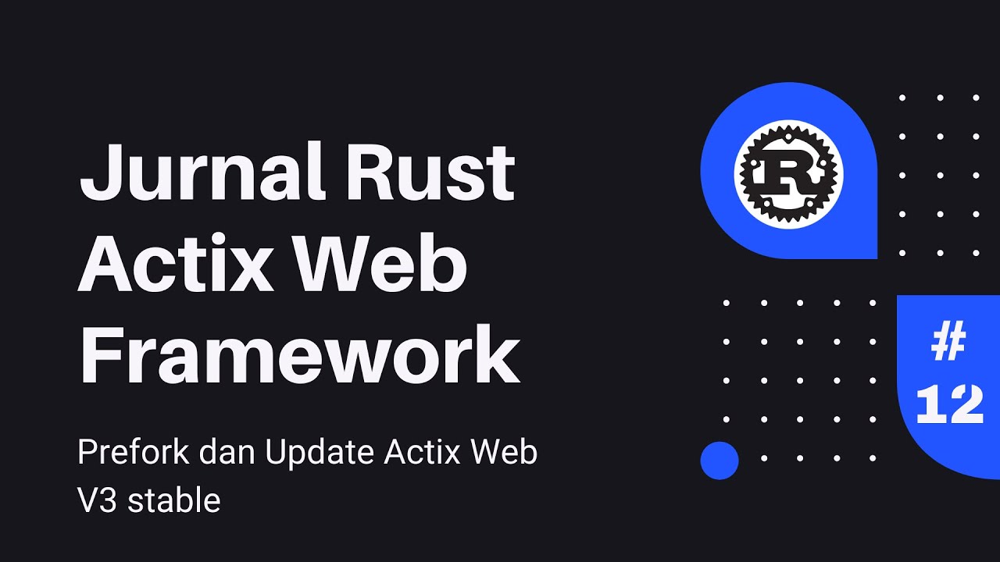

# donatello


[](https://www.youtube.com/watch?v=9hMwJM3fzKU)

Ini merupakan jurnal berkaitan dengan penggunaan rust actix framework. Perlu penambahan **Environment Variabel** dalam 
bentuk file _.env_ sebagai berikut:

```
RUST_LOG=debug
APP_HOST=127.0.0.1
APP_PORT=8080
DATABASE_URL=donatello.db
```

Lakukan instalasi _Diesel CLI_ melalui perintah:
`cargo install diesel_cli --no-default-features --features sqlite`

Apabila muncul `cannot find -lsqlite3` di Linux/Ubuntu, lakukan perintah:
`sudo apt install libsqlite-dev`
